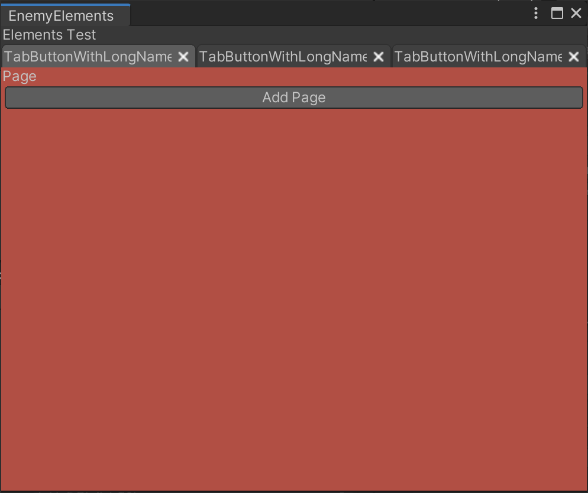

# UI Widgets for Unity
Widgets for developing with Unity's UIElements (aka UI Toolkit). This is my repository for UI elements I have developed for Unity's editor to support my work. These may be useful for you as either examples or a foundation upon which to create your own work!

## Tabs

TabbedView and TabbedViewController allow for a tabbed interface. Tabs and their associated views are generally controlled by CSS, with a little bit of code to glue it together.

Example code and css is provided.